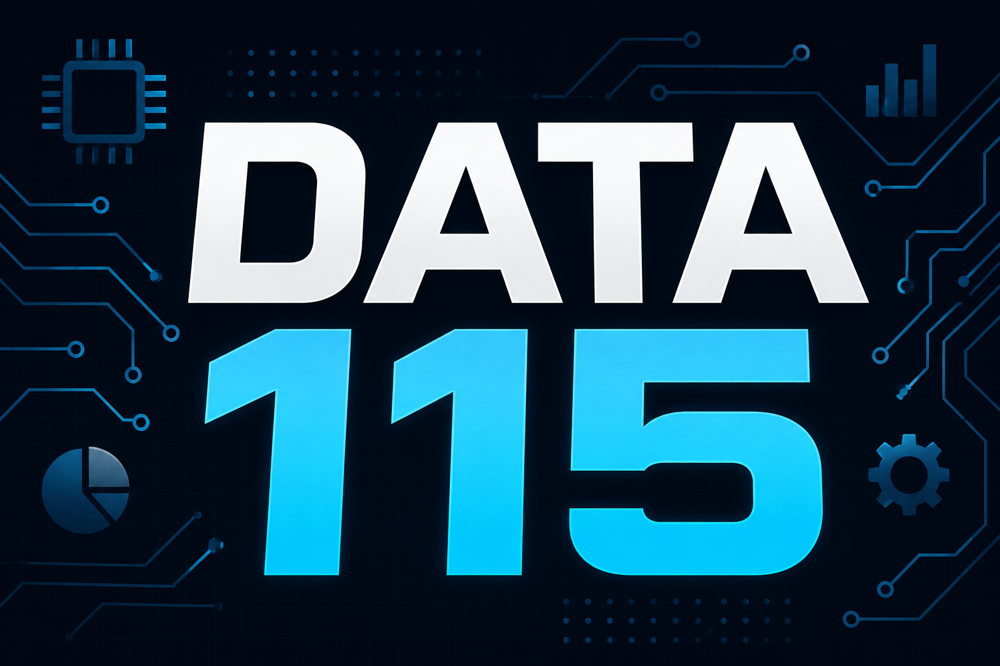

for PXT/microbit

# DATA115 LSU



Maker Lab micro:bit extension for DATA 115 at La Sierra University.

## Features
- Raw LCD1602 support (No I2C backpack required)
- OLED display support
- OLED graphics and animations
- MPU6050 / GY-521 support
- Environmental sensor helpers
- Motion sensor utilities
- Rotary encoder support
- Lighting and LED functions
- Dashboard display functions
- Datalogger integration
- Custom Maker Lab blocks for teaching and projects

## Supported Hardware
### Displays
- LCD1602 Parallel Displays
- SSD1306 OLED Displays
- 7 Segment Displays

### Sensors
- MPU6050 / GY-521
- DHT11 Temperature & Humidity
- Ultrasonic Sensors
- Light Sensors
- Sound Sensors
- Shock Sensors
- Tilt Sensors
- Motion Sensors
- Rotary Encoders

### Output Modules
- LEDs
- RGB LEDs
- Buzzers
- Relays

## Installation
1. Open MakeCode for micro:bit
2. Click Extensions
3. Search:

DATA115 LSU

or

ariv510-cell/DATA115-LSU

4. Add the extension

## Example
```typescript
rawLCD1602.init(
DigitalPin.P0,
DigitalPin.P1,
DigitalPin.P8,
DigitalPin.P12,
DigitalPin.P13,
DigitalPin.P14
)

basic.forever(function () {
    rawLCD1602.clear()
    rawLCD1602.printLine("DATA115 LSU", 0)
    rawLCD1602.printLine("Maker Lab", 1)
    basic.pause(1000)
})
